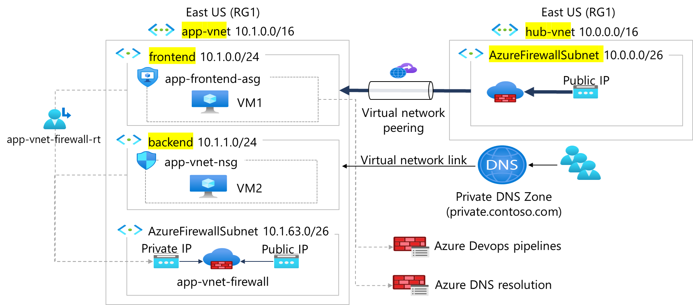

---
lab:
  title: "Exercice\_01\_: créer et configurer des réseaux virtuels"
  module: Guided Project - Configure secure access to workloads with Azure virtual networking services
---

# Exercice 01 : créer et configurer des réseaux virtuels

## Scénario

Votre organisation migre une application Web vers Azure. Votre première tâche consiste à mettre en place les réseaux virtuels et les sous-réseaux. Vous devez également homologuer en toute sécurité les réseaux virtuels. Vous identifiez ces exigences. 
+ Deux réseaux virtuels sont nécessaires, **app-vnet** et **hub-vnet**. Cela simule une architecture réseau en étoile. 
+ Le réseau app-vnet hébergera l’application. Ce réseau virtuel nécessite deux sous-réseaux. Le **sous-réseau frontend** hébergera les serveurs Web. Le **sous-réseau backend** hébergera les serveurs de base de données.
+ Le réseau hub-vnet nécessite un sous-réseau uniquement pour le pare-feu. 
+ Les deux réseaux virtuels doivent être capables de communiquer entre eux de manière sécurisée et en privé via un **appairage de réseaux virtuels**. 
+ Les deux réseaux virtuels doivent se trouver dans la même région. 

## Tâches d'apprentissage

+ Créer un réseau virtuel.
+ Créez un sous-réseau.
+ Configurez VNET Peering.

## Diagramme de l'architecture

## Instructions de l’exercice

**Remarque** : pour terminer ce labo, vous aurez besoin d’un [abonnement Azure](https://azure.microsoft.com/free/) avec le rôle RBAC **Contributeur** affecté. Dans ce labo, utilisez la valeur par défaut pour toutes les propriétés qui ne sont pas spécifiées quand vous êtes invité à créer une ressource.

### Créer des réseaux virtuels en étoile et des sous-réseaux

Un [réseau virtuel Azure](https://learn.microsoft.com/azure/virtual-network/virtual-networks-overview) permet à de nombreux types de ressources Azure de communiquer de manière sécurisée entre eux, avec Internet et avec des réseaux locaux. Toutes les ressources Azure d’un réseau virtuel sont déployées en [sous-réseaux](https://learn.microsoft.com/azure/virtual-network/virtual-network-manage-subnet?tabs=azure-portal) au sein de ce réseau virtuel. 

1. Connectez-vous au **portail Azure** - `https://portal.azure.com`.
   
1. Recherchez et sélectionnez `Virtual Networks`.
   
1. Sélectionnez **+ Créer** et effectuez la configuration du réseau **app-vnet**. Ce réseau virtuel nécessite deux sous-réseaux, **front-end** et **backend**. 

    | Propriété             | Valeur           |
    | :------------------- | :-------------- |
    | Groupe de ressources       | **RG1**         |
    | Nom du réseau virtuel | `app-vnet`    |
    | Région               | **USA Est**     |
    | Espace d’adressage IPv4   | **10.1.0.0/16** |
    | Nom du sous-réseau          | `frontend`    |
    | Plage d’adresses de sous-réseau | **10.1.0.0/24** |
    | Nom du sous-réseau          | `backend`     |
    | Plage d’adresses de sous-réseau | **10.1.1.0/24** |

    **Remarque** : laissez les autres paramètres avec leurs valeurs par défaut. Une fois terminé, sélectionnez **Examiner + créer**, puis **Créer**.
   
1. Créez la configuration du réseau virtuel **Hub-vnet**. Ce réseau virtuel comporte le sous-réseau de pare-feu. 

    | Propriété             | Valeur                    |
    | :------------------- | :----------------------- |
    | Groupe de ressources       | **RG1**                  |
    | Nom                 | `hub-vnet` |
    | Région               | **USA Est**              |
    | Espace d’adressage IPv4   | **10.0.0.0/16**          |
    | Nom du sous-réseau          | **AzureFirewallSubnet**  |
    | Plage d’adresses de sous-réseau | **10.0.0.0/24**          |

1. Une fois les déploiements terminés, recherchez et sélectionnez vos réseaux virtuels.

1. Vérifiez que vos réseaux virtuels et sous-réseaux ont été déployés. 

### Configurer une relation d’homologue entre les réseaux virtuels

L’[appairage de réseaux virtuels](https://learn.microsoft.com/azure/virtual-network/virtual-network-peering-overview) vous permet de connecter en toute fluidité deux réseaux virtuels ou plus dans Azure. 

1. Recherchez et sélectionnez le réseau virtuel `app-vnet`.
   
1. Sous **Paramètres**, sélectionnez **Peerings**.
   
1. Sélectionnez **+ Ajouter** pour ajouter un peering entre les deux réseaux virtuels. 

    | Propriété                                 | Valeur                          |
    | :--------------------------------------- | :----------------------------- |
    | Nom du lien de peering distant              | `app-vnet-to-hub` |
    | Réseau virtuel    | `hub-vnet` |
    | Nom du lien de peering de réseaux virtuels locaux | `hub-to-app-vnet` |

    **Remarque** : laissez les autres paramètres avec leurs valeurs par défaut. Sélectionnez **« Ajouter »** pour créer l’appairage de réseaux virtuels.

1. Une fois le déploiement terminé, vérifiez que l’**état de peering** est **Connecté**.

## En savoir plus avec la formation en ligne

+ [Présentation des réseaux virtuels Azure](https://learn.microsoft.com/training/modules/introduction-to-azure-virtual-networks/). Dans ce module, vous apprenez à concevoir et à implémenter des services de mise en réseau Azure. Vous y découvrez les réseaux virtuels, les adresses IP publiques et privées, le DNS, l’appairage de réseaux virtuels, le routage et la NAT virtuelle Azure.

## Points clés

Félicitations ! Vous avez terminé l’exercice. Voici les points clés principaux :

+ Les réseaux virtuels Azure (VNet) fournissent un environnement réseau sécurisé et isolé pour vos ressources cloud. Vous pouvez créer plusieurs réseaux virtuels par région et par abonnement.
+ Lors de la conception de réseaux virtuels, assurez-vous que l’espace d’adressage de réseau virtuel (bloc CIDR) ne chevauche pas d’autres plages réseau de votre organisation.
+ Un sous-réseau est une plage d’adresses IP dans le réseau virtuel. Vous pouvez segmenter les réseaux virtuels en sous-réseaux de différentes tailles, en créant autant de sous-réseaux que nécessaire pour l’organisation et la sécurité dans le cadre de la limite de votre abonnement. Chaque sous-réseau doit avoir une plage d’adresses unique.
+ Certains services Azure, tel que Pare-feu Azure, nécessitent leur propre sous-réseau.
+ Le peering de réseaux virtuels vous permet de connecter deux réseaux virtuels Azure en toute transparence. Les réseaux virtuels apparaissent comme un seul réseau à des fins de connectivité.
