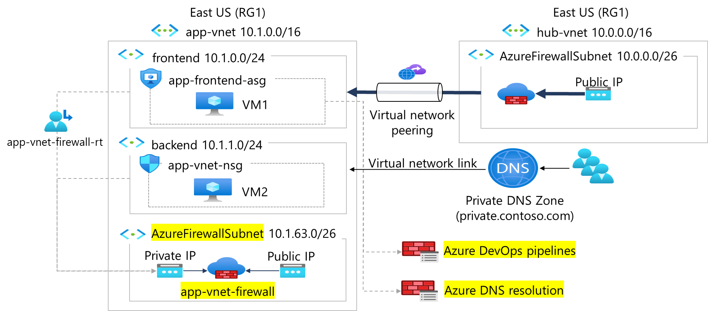

---
lab:
  title: "Exercice\_03\_: créer et configurer un Pare-feu Azure"
  module: Guided Project - Configure secure access to workloads with Azure virtual networking services
---

# Exercice 03 : créer et configurer un Pare-feu Azure

## Scénario

Votre organisation nécessite une sécurité réseau centralisée pour le réseau virtuel d’application. À mesure que l’utilisation de l’application augmente, un filtrage au niveau de l’application plus précis et une protection avancée contre les menaces seront nécessaires. En outre, il est prévu que l’application aura besoin de mises à jour continues à partir de pipelines Azure DevOps. Vous identifiez ces exigences.
+ Pare-feu Azure est nécessaire pour une sécurité supplémentaire dans le réseau app-vnet. 
+ Une **stratégie de pare-feu** doit être configurée pour aider à gérer l’accès à l’application. 
+ Une **règle d’application** de stratégie de pare-feu est nécessaire. Cette règle permettra à l’application d’accéder à Azure DevOps afin que le code de l’application puisse être mis à jour. 
+ Une **règle de réseau** de stratégie de pare-feu est nécessaire. Cette règle autorisera la résolution DNS. 

### Tâches d'apprentissage

+ Créez un Pare-feu Azure.
+ Créer et configurer une stratégie de pare-feu
+ Créez une collection de règles d’application.
+ Créez une collection de règles de réseau.

## Diagramme de l'architecture

  
## Instructions de l’exercice

### Créer le sous-réseau Pare-feu Azure dans notre réseau virtuel existant

1. Dans la zone de recherche située en haut du portail, entrez **Réseaux virtuels**. Sélectionnez **Réseaux virtuels** dans les résultats de la recherche.

1. Sélectionnez **app-vnet**.

1. Sélectionner **Sous-réseaux**.

1. Sélectionnez **+ Sous-réseau**.

1. Saisissez les informations suivantes, puis cliquez sur **Enregistrer** :

    | Propriété      | Valeur                   |
    | :------------ | :---------------------- |
    | Nom          | **AzureFirewallSubnet** |
    | Plage d’adresses | **10.1.63.0/24**        |

**Remarque** : laissez les autres paramètres par défaut.

### Créer un pare-feu Azure

1. Dans la zone de recherche située en haut du portail, entrez **Pare-feu**. Sélectionnez **Pare-feu** dans les résultats de la recherche.

1. Sélectionnez **+ Créer**.

1. Créez un pare-feu à l’aide des valeurs indiquées dans le tableau suivant. Pour toute propriété qui n’est pas spécifiée, utilisez la valeur par défaut.
    >**Remarque** : le déploiement du Pare-feu Azure peut prendre quelques minutes.

    | Propriété                 | Valeur                                             |
    | :----------------------- | :------------------------------------------------ |
    | Groupe de ressources           | **RG1**                                           |
    | Nom                     | **app-vnet-firewall**                             |
    | Référence SKU de pare-feu             | **Standard**                                      |
    | Gestion de pare-feu      | **Utiliser une stratégie de pare-feu pour gérer ce pare-feu** |
    | Stratégie de pare-feu          | sélectionnez **Ajouter**                                |
    | Nom de stratégie              | **fw-policy**                                     |
    | Région                   | **USA Est**                                       |
    | Niveau de stratégie              | **Standard**                                      |
    | Choisir un réseau virtuel | **Utiliser existant**                                  |
    | Réseau virtuel          | **app-vnet** (RG1)                                |
    | Adresse IP publique        | Ajouter nouveau : **fwpip**                                |
    | Activer la carte réseau de gestion de pare-feu | **Décocher la case**                         |

    [En savoir plus sur la création d’un pare-feu](https://docs.microsoft.com/azure/firewall/tutorial-firewall-deploy-portal).

1. Sélectionnez **Vérifier + créer**, puis sélectionnez **Créer**.

### Mettre à jour la stratégie de pare-feu

1. Dans le portail, recherchez et sélectionnez `Firewall Policies`. 

1. Sélectionnez **fw-policy**.

### Ajouter une règle d’application

1. Dans le panneau **Paramètres**, sélectionnez **Règles d’application**, puis **Ajouter un regroupement de règles**.

1. Configurez le regroupement de règles d’application, puis sélectionnez **Ajouter**. 

    | Propriété               | Valeur                                     |
    | :--------------------- | :---------------------------------------- |
    | Nom                   | `app-vnet-fw-rule-collection`         |
    | Type de regroupement de règles   | **Application**                           |
    | Priorité               | `200`                                   |
    | Action de regroupement de règles | **Autoriser**                                 |
    | Groupe de regroupement de règles  | **DefaultApplicationRuleCollectionGroup** |
    | Nom             | `AllowAzurePipelines`                |
    | Type de source      | **Adresse IP**                         |
    | Source           | `10.1.0.0/23`                       |
    | Protocol         | `https`                             |
    | Type de destination | **FQDN**                                  |
    | Destination      | `dev.azure.com, azure.microsoft.com` |

**Remarque** : la règle **AllowAzurePipelines** permet à l’application web d’accéder à Azure Pipelines. La règle permet à l’application web d’accéder au service Azure DevOps et au site web Azure.

### Ajouter une règle de réseau

1. Dans le panneau **Paramètres**, sélectionnez **Règles de réseau**, puis **Ajouter un regroupement réseau**.

1. Configurez la règle de réseau, puis sélectionnez **Ajouter**.  

    | Propriété               | Valeur                                 |
    | :--------------------- | :------------------------------------ |
    | Nom                   | `app-vnet-fw-nrc-dns`               |
    | Type de regroupement de règles   | **Réseau**                           |
    | Priorité               | `200`                        |
    | Action de regroupement de règles | **Autoriser**                             |
    | Groupe de regroupement de règles  | **DefaultNetworkRuleCollectionGroup** |
    | Règle                  | **AllowDns**         |
    | Source                | `10.1.0.0/23`      |
    | Protocol              | **UDP**              |
    | Ports de destination     | `53`               |
    | Adresses de destination | **1.1.1.1, 1.0.0.1** |

### Vérifier l’état du pare-feu et de la stratégie de pare-feu

1. Dans le portail, recherchez et sélectionnez **Pare-feu**. 

1. Affichez le pare-feu **app-vnet-firewall** et vérifiez que l’**état d’approvisionnement** est **Réussi**. Cela peut prendre quelques minutes. 

1. Dans le portail, recherchez et sélectionnez **Stratégies de pare-feu**.

1. Affichez la stratégie **fw-policy** et vérifiez que l’**état d’approvisionnement** est **Réussi**. Cela peut prendre quelques minutes.

### En savoir plus avec la formation en ligne

+ [Présentation du Pare-feu Azure](https://learn.microsoft.com/training/modules/introduction-azure-firewall/). Dans ce module, vous découvrez le fonctionnement, les règles, les options de déploiement et l’administration de Pare-feu Azure.
+ [Présentation d’Azure Firewall Manager](https://learn.microsoft.com/training/modules/intro-to-azure-firewall-manager/). Dans ce module, vous découvrez comment Azure Firewall Manager permet de centraliser la gestion des stratégies de sécurité et des itinéraires pour les périmètres de sécurité basés sur le cloud.

### Points clés

Félicitations ! Vous avez terminé l’exercice. Voici les points clés principaux :

+ Le Pare-feu Azure est un service de sécurité basé sur le cloud qui protège vos ressources Réseau virtuel Azure des menaces entrantes et sortantes.
+ Une stratégie de Pare-feu Azure est une ressource qui contient un ou plusieurs regroupements de règles NAT, de réseau et d’application.
+ Les règles de réseau autorisent ou refusent le trafic en fonction des adresses IP, des ports et des protocoles.
+ Les règles d’application autorisent ou refusent le trafic en fonction des noms de domaine complets (FQDN), des URL et des protocoles HTTP/HTTPS.
