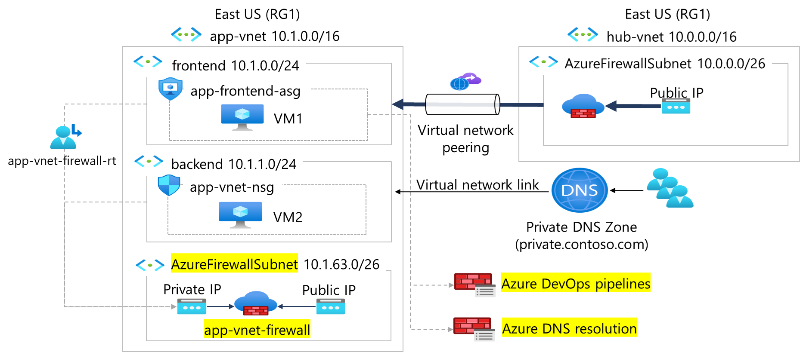

---
lab:
  title: "Exercice\_04\_: configurer le routage réseau"
  module: Guided Project - Configure secure access to workloads with Azure virtual networking services
---

# Exercice 04 : configurer le routage réseau

## Scénario

Pour vous assurer que les stratégies de pare-feu sont appliquées, le trafic d’application sortant doit être acheminé via le pare-feu. Vous identifiez ces exigences. 
+ Une table de route est nécessaire. Cette table de route sera associée aux sous-réseaux frontend et back-end.  
+ Un itinéraire est nécessaire pour filtrer tout le trafic IP sortant des sous-réseaux vers le pare-feu. L’adresse IP privée du pare-feu sera utilisée. 

## Tâches d'apprentissage

+ Créez et configurez une table de routage.
+ Lier une table de route à un sous-réseau.
  
## Diagramme de l'architecture

## Instructions de l’exercice

### Créer une table de routage

Azure crée automatiquement une [table de route](https://learn.microsoft.com/azure/virtual-network/virtual-networks-udr-overview) pour chaque sous-réseau au sein d’un réseau virtuel Azure. La table de route inclut les [itinéraires système](https://learn.microsoft.com/azure/virtual-network/virtual-networks-udr-overview#system-routes) par défaut. Vous pouvez créer des tables de route et des itinéraires pour remplacer les itinéraires système par défaut d’Azure.

**Enregistrer l’adresse IP privée de app-vnet-firewall**

1. Dans la zone de recherche située en haut du portail, entrez **Pare-feu**. Sélectionnez **Pare-feu** dans les résultats de la recherche.

1. Sélectionnez **app-vnet-firewall**.

1. Sélectionnez **Vue d’ensemble** et enregistrez l’**Adresse IP privée**.

**Ajouter la table de route**

1. Dans la zone de recherche, entrez **tables de route**. Quand le terme table de route s’affiche dans les résultats de recherche, sélectionnez-le.

1. Dans la page Table de route, sélectionnez **+ Créer** et créez la table de route. 

    | Propriété       | Valeur                        |
    | :------------- | :--------------------------- |
    | Abonnement   | **Sélectionnez votre abonnement** |
    | Resource group | **RG1**                      |
    | Région         | **USA Est**                  |
    | Nom           | `app-vnet-firewall-rt`     |

1. Sélectionnez **Vérifier + créer**, puis **Créer**.

1. Attendez que la table de route soit déployée, puis sélectionnez **Accéder à la ressource**.  

### Associer la table de route au sous-réseaux

1. Dans le portail, continuez à utiliser la table de route, sélectionnez **app-vnet-firewall-rt**.

1. Dans le panneau **Paramètres**, sélectionnez **Sous-réseaux**, puis **+ Associer**.

1. Configurez une association au sous-réseau frontend, puis sélectionnez **OK**.  

    | Propriété        | Valeur              |
    | :-------------- | :----------------- |
    | Réseau virtuel | **app-vnet** (RG1) |
    | Sous-réseau          | **frontend**       |

1. Configurez une association au sous-réseau backend, puis sélectionnez **OK**.  

    | Propriété        | Valeur              |
    | :-------------- | :----------------- |
    | Réseau virtuel | **app-vnet** (RG1) |
    | Sous-réseau          | **serveur principal**       |

### Créer une route dans la table de route

1. Dans le portail, continuez à utiliser la table de route, sélectionnez **app-vnet-firewall-rt**.

1. Dans le panneau **Paramètres** , sélectionnez **Itinéraires**, puis **+ Ajouter**.

1. Configurez l’itinéraire, puis sélectionnez **Ajouter**. 

    | Propriété                            | Valeur                                                   |
    | :---------------------------------- | :------------------------------------------------------ |
    | Nom de l’itinéraire                          | **outbound-firewall**                                   |
    | Type de destination                    | **Adresses IP**                                        |
    | Plage d’adresses IP/CIDR de destination | **0.0.0.0/0**                                           |
    | Type de tronçon suivant                       | **Appliance virtuelle**                                   |
    | adresse de tronçon suivant                    | **adresse IP privée du pare-feu** |

### En savoir plus avec la formation en ligne

+ [Gérez et contrôlez le flux de trafic dans votre déploiement Azure à l’aide de routes](https://learn.microsoft.com/training/modules/control-network-traffic-flow-with-routes/). Dans ce module, vous découvrez comment contrôler le trafic du réseau virtuel Azure en implémentant des itinéraires personnalisés. Ce module comporte deux bacs à sable. 

### Points clés

Félicitations ! Vous avez terminé l’exercice. Voici les points clés principaux :

+ Le trafic réseau dans Azure transite automatiquement entre les sous-réseaux, les réseaux virtuels et les réseaux locaux Azure. Les itinéraires système contrôlent ce routage.
+ Les itinéraires définis par l’utilisateur remplacent les itinéraires système par défaut de façon à faire transiter le trafic par des appliances virtuelles réseau (NVA). 
+ Les appliances virtuelles réseau (NVA) contrôlent le flux de trafic réseau. Les pare-feu, équilibreurs de charge et routeurs sont des exemples de NVA.
+ Les tables de route contiennent des informations de routage et sont associées à un sous-réseau. 
