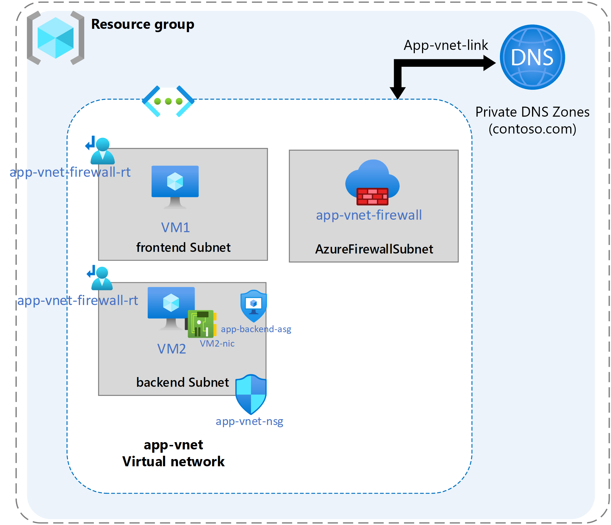

---
lab:
  title: "Exercice\_: enregistrer et résoudre les noms de domaine en interne"
  module: Guided Project - Configure secure access to workloads with Azure virtual networking services
---

# Labo : enregistrer et résoudre les noms de domaine en interne

## Scénario

Votre organisation exige que les charges de travail enregistrent et résolvent les noms de domaine en interne dans les réseaux virtuels. Les machines virtuelles des réseaux virtuels peuvent utiliser le nom de domaine au lieu des adresses IP pour la communication interne. Dans ce cas, les noms de domaine sont résolus avec une zone DNS privée via une liaison de réseau virtuel.

### Diagramme de l'architecture

### Tâches d'apprentissage

- Créer et configurer une zone DNS privée.
- Créez et configurez des enregistrements DNS.
- Configurez les paramètres DNS sur un réseau virtuel.

## Instructions de l’exercice

### Créer une zone DNS privée

Le DNS privé Azure fournit un service DNS fiable et sécurisé pour gérer et résoudre les noms de domaine dans un réseau virtuel sans nécessiter l’ajout de solution DNS personnalisée. Grâce aux zones DNS privées, vous pouvez utiliser vos propres noms de domaine personnalisés au lieu des noms fournis par Azure actuellement disponibles.

1. Dans la barre de recherche du portail, tapez **Zones dns privées**, puis sélectionnez les zones DNS privées dans les résultats.

1. Sélectionnez **+ Créer**.

1. Dans l’onglet **De base** de Créer une zone DNS privée, entrez les informations indiquées dans le tableau ci-dessous :

    | Propriété       | Valeur                        |
    | :------------- | :--------------------------- |
    | Abonnement   | **Sélectionnez votre abonnement** |
    | Resource group | **RG1**                      |
    | Nom           | **contoso.com**              |
    | Région         | **USA Est**                  |

1. Sélectionnez **Vérifier + créer**, puis sélectionnez **Créer**.

### Créer une liaison de réseau virtuel vers votre zone DNS privée

1. Dans la barre de recherche du portail, tapez **Zones dns privées**, puis sélectionnez les zones DNS privées dans les résultats.

1. Sélectionnez **contoso.com**.

1. Sélectionnez **+ Liaison de réseau virtuel**.

1. Sélectionnez **« + Ajouter »**.

1. Dans l’onglet **De base** de Créer une liaison de réseau virtuel, entrez les informations indiquées dans le tableau ci-dessous :

    | Propriété                 | Valeur             |
    | :----------------------- | :---------------- |
    | Nom de la liaison                | **app-vnet-link** |
    | Réseau virtuel          | **app-vnet**      |
    | Activer l’inscription automatique | **Activé**       |

1. Sélectionnez **OK**.

### Créer un jeu d’enregistrements DNS

1. Dans la barre de recherche du portail, tapez **Zones dns privées**, puis sélectionnez les zones DNS privées dans les résultats.

1. Sélectionnez **contoso.com**.

1. Sélectionnez **+ Jeu d’enregistrements**.

1. Dans l’onglet **De base** de Créer un jeu d’enregistrements, entrez les informations indiquées dans le tableau ci-dessous :

    | Propriété   | Valeur        |
    | :--------- | :----------- |
    | Nom       | **serveur principal**  |
    | Type       | **A**        |
    | TTL        | **1**        |
    | Adresse IP | **10.1.1.4** |

1. Sélectionnez **OK**.

1. Vérifiez que **contoso.com** dispose d’un jeu d’enregistrements nommé **back-backend**
